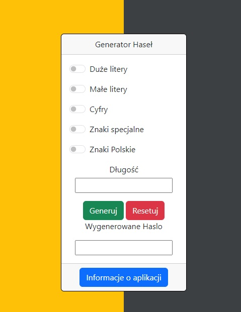

# :desktop_computer: PasswordGenerator

The application automatically generates a random password using the characters selected by the user. It displays the password in a secure manner, allowing for easy copying or memorization. This ensures that the user can be confident that the password is secure and difficult to guess.

## :framed_picture: Screenshots

## :joystick: Demo

https://kamilkeder.github.io/PasswordGenerator/

## :e-mail: Feedback

If you have any feedback, please reach out to me at kontaktkkeder@gmail.com
